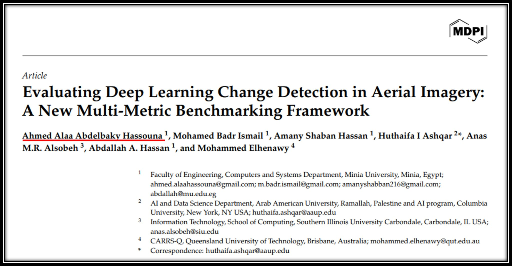

[](https://www.mdpi.com/)
[](https://www.springer.com/journal/12145)
[](https://lnkd.in/d5GufM97)

# Evaluating Deep Learning Change Detection in Aerial Imagery: A New Multi-Metric Benchmarking Framework



## 🎓 Graduation Research Project

This repository contains the research work for my graduation project as part of the **ITI Data Engineering Track**. I am honored to be one of the first authors of this groundbreaking research article currently under peer review at **Earth Science Informatics (Springer)**.

## 📄 Publication Information

**Title:** Evaluating Deep Learning Change Detection in Aerial Imagery: A New Multi-Metric Benchmarking Framework

**Authors:** 
- **Ahmed Alaa Abdelbaky Hassouna** (First Author) - Minia University, Egypt
- Mohamed Badr Ismail - Minia University, Egypt
- Amany Shaban Hassan - Minia University, Egypt
- Huthaifa I Ashqar (Corresponding Author) - Arab American University & Columbia University
- Anas M.R. Alsobeh - Southern Illinois University, USA
- Abdallah A. Hassan - Minia University, Egypt
- Mohammed Elhenawy - Queensland University of Technology, Australia

**Journal:** Earth Science Informatics (Springer)  
**Status:** Under Peer Review  
**Preprint:** [Available Here](https://lnkd.in/d5GufM97)

## 🧠 Research Overview

This research proposes a **comprehensive benchmarking framework** for evaluating deep learning models in **change detection (CD)** from aerial imagery. Change detection is a critical technology with applications in:

- 🏙️ **Urban Planning** - Monitoring urban growth and infrastructure development
- 🌍 **Environmental Monitoring** - Tracking deforestation, land use changes, and climate impact
- 🚨 **Disaster Response** - Assessing damage from natural disasters for rapid response
- 🛰️ **Remote Sensing** - Large-scale geospatial analysis and mapping

## 🎯 Key Contributions

### Multi-Dimensional Evaluation Framework

Our framework evaluates deep learning models across **three critical dimensions**:

1. **✅ Cross-Dataset Generalizability**
   - Assesses how well models transfer across different geographic regions, resolutions, and imaging conditions
   - Tests robustness when trained on one dataset and evaluated on another

2. **✅ Sensitivity to Change Size & Complexity**
   - Evaluates model performance on subtle vs. dramatic changes
   - Analyzes detection accuracy across varying spatial scales
   - Uses contour-based metrics to assess complex change patterns

3. **✅ Robustness to Noise & Image Corruption**
   - Tests model resilience against real-world image degradation
   - Simulates various noise profiles and corruption scenarios
   - Measures performance stability under adverse conditions

### Research Impact

📌 **For Researchers:** Enables informed model selection by revealing strengths and limitations of existing architectures

📌 **For Practitioners:** Guides the development of better models through systematic identification of failure modes

📌 **For System Designers:** Facilitates smarter ensemble strategies or custom model designs tailored to specific use cases

🧠 **Broader Applicability:** The methodology is adaptable to other domains requiring robustness and transferability, including Large Language Models (LLMs) and general AI systems

## 🛠️ Technical Achievements & My Contributions

As a **first author and core contributor**, I was deeply involved in both research design and technical implementation:

### Data Engineering & Preprocessing
- 🔁 **Designed and automated robust preprocessing pipelines** for large-scale aerial imagery datasets
- 🗂️ **Cleaned and managed diverse geospatial datasets** with varying resolutions, coordinate systems, and noise profiles
- 📊 **Handled multi-source data integration** from different satellite platforms and imaging sensors
- 🔧 **Implemented data quality validation** frameworks to ensure dataset integrity

### Scalable Benchmarking Infrastructure
- 🔬 **Built scalable, reproducible workflows** for systematic benchmarking across multiple datasets and deep learning models
- ⚡ **Optimized computational pipelines** for efficient processing of high-resolution aerial imagery
- 🐳 **Containerized experimental environments** for reproducibility and cross-platform compatibility
- 📈 **Automated performance tracking** and metric collection across experiment runs

### Evaluation Metrics & Analysis
- 📈 **Developed statistical and contour-based evaluation metrics** to uncover model limitations in subtle or complex change scenarios
- 🎯 **Designed novel sensitivity analysis** frameworks for change size and complexity
- 📊 **Created comprehensive visualization tools** for multi-dimensional performance analysis
- 🔍 **Performed in-depth statistical analysis** to validate findings and ensure scientific rigor

### Research Communication
- 📖 **Co-authored the manuscript**, enhancing technical writing, academic publication, and collaborative research communication skills
- 📝 **Contributed to experimental design** and methodology sections
- 🎤 **Prepared presentations** for research seminars and academic reviews

## 🚀 Impact on Data Engineering Career

This research project provided invaluable real-world experience in:

### Core Data Engineering Skills
1. **Working with High-Volume, Complex Datasets**
   - Managed terabytes of aerial imagery data
   - Handled diverse data formats (GeoTIFF, HDF5, COG)
   - Processed multi-temporal, multi-spectral satellite data

2. **Building Scalable, Automated Data Pipelines**
   - Implemented end-to-end ETL workflows
   - Developed fault-tolerant processing systems
   - Created monitoring and logging infrastructure

3. **Extracting Insights from Unstructured Data**
   - Applied deep learning to geospatial imagery
   - Transformed visual data into actionable intelligence
   - Developed AI-driven decision support systems

4. **Delivering Scalable, Reproducible, Insight-Driven Systems**
   - Built containerized, cloud-ready research infrastructure
   - Implemented version control for data, code, and experiments
   - Created comprehensive documentation and knowledge transfer materials

### Technical Skills Developed
- **Languages:** Python, Shell scripting
- **Deep Learning Frameworks:** PyTorch, TensorFlow
- **Data Processing:** NumPy, Pandas
- **Visualization:** Matplotlib, Seaborn for scientific visualization
- **Cloud Platforms:** Experience with google colab

## 🤝 International Collaboration

This research represents a truly global collaboration across multiple prestigious institutions:

🌍 **Minia University** - Egypt  
🌍 **Arab American University** - Palestine  
🌍 **Columbia University** - USA  
🌍 **Southern Illinois University** - USA  
🌍 **Queensland University of Technology (QUT)** - Australia  

Working with international collaborators enhanced my:
- Cross-cultural communication skills
- Remote collaboration capabilities
- Understanding of global research standards
- Professional networking in the academic community
## 🔗 Links & Resources

- 📄 **Preprint:** [Read the full paper](https://lnkd.in/d5GufM97)
- 📚 **Journal:** [Earth Science Informatics (Springer)](https://www.springer.com/journal/12145)
- 💼 **LinkedIn:** [[Connect with me](https://www.linkedin.com/in/ahmed-alaa-hassouna/)](#)
- 🐙 **GitHub:** [https://github.com/ahmed-hassouna](#)

## 📧 Contact

**Ahmed Alaa Abdelbaky Hassouna**  
Faculty of Engineering, Computers and Systems Department  
Minia University, Minia, Egypt  
📧 Email: ahmed.alaahassouna@gmail.com

**Corresponding Author:**  
**Dr. Huthaifa I Ashqar**  
📧 Email: huthaifa.ashqar@aaup.edu

## 🙏 Acknowledgments

I am deeply grateful to:
- My co-authors and research collaborators from five international institutions
- The faculty and mentors at Minia University
- The reviewers and editorial team at Earth Science Informatics

## 📜 Citation

If you use this work in your research, please cite:

```bibtex
@article{hassouna2024evaluating,
  title={Evaluating Deep Learning Change Detection in Aerial Imagery: A New Multi-Metric Benchmarking Framework},
  author={Hassouna, Ahmed Alaa Abdelbaky and Ismail, Mohamed Badr and Hassan, Amany Shaban and Ashqar, Huthaifa I and Alsobeh, Anas M.R. and Hassan, Abdallah A. and Elhenawy, Mohammed},
  journal={Earth Science Informatics},
  year={2024},
  publisher={Springer},
  note={Under Review}
}
```

## 📌 Tags

`#DeepLearning` `#ChangeDetection` `#RemoteSensing` `#AerialImagery` `#ComputerVision` `#DataEngineering` `#MachineLearning` `#GeospatialAnalysis` `#ResearchPaper` `#AcademicResearch` `#GraduationProject` `#DataScience` `#AI` `#UrbanPlanning` `#EnvironmentalMonitoring`

---

**⭐ If you find this research valuable, please consider starring this repository and sharing it with others in the remote sensing and deep learning communities!**
